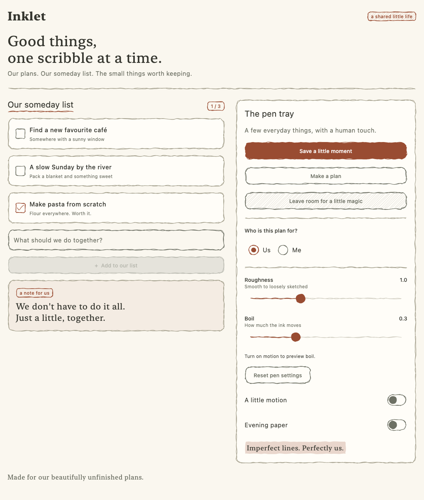

# Inklet

A native Kotlin / Compose Multiplatform port of the hand-drawn renderer from
[Drawably](https://github.com/Danilaa1/drawably). Targets Android,
iOS arm64, the iOS arm64 simulator, desktop JVM, and WebAssembly (Wasm/JS).
The browser showcase renders the same Compose components on a canvas.

[Try the live component gallery](https://blog.ggoggam.dev/inklet/)



## Run

This is an independent Gradle project with its own wrapper and a shared gallery under `sample/`.
Use JDK 17 or newer and an installed Android SDK (API 36). Set `ANDROID_HOME` or create a
local `local.properties` containing `sdk.dir=/path/to/android/sdk`.

```sh
./gradlew desktopTest
./gradlew :sample:run
./gradlew :sample:wasmJsBrowserDevelopmentRun  # browser gallery
./gradlew compileKotlinIosSimulatorArm64  # macOS with Xcode
```

The gallery supports adding wishes, checking them off, selecting a radio option,
saving a moment, changing between light and dark colors, and disabling motion.
Live roughness (0–3) and boil (0–1) sliders sit directly below the gallery title,
with numeric readouts, reset, motion, and theme controls visible before the examples.
Roughness defaults to 0.3. They update the entire gallery; enable motion to see boil.
The “Little choices” panel demonstrates action and selectable chips, removable input,
and icon buttons with a favorite toggle. The sample bundles five Lucide Compose
vectors locally; Material `Icon` provides their theme tint.
Linear and circular indicators show wish completion and indeterminate loading.
Check wishes to change progress; loading keeps moving with boil set to zero.
Sample data lives only in memory. To export a deterministic native rendering:

```sh
./gradlew :sample:run --args='--snapshot /tmp/inklet.png 1120 1700'
./gradlew :sample:run --args='--snapshot /tmp/inklet-dark.png 1120 1700 --dark'
```

Toolchain: Kotlin 2.4.0-RC, Compose 1.11.0, Material 3 1.9.0, AGP 9.2.1,
Gradle 9.4.1.

### Browser showcase

Run `mise run dev:web` (or the Gradle command above) and open the local URL printed
by the development server, usually `http://localhost:8080`. Use a modern browser
with WasmGC support. The same shared gallery includes editable text, selection
controls, popups, and live pen settings; sample data resets when the page reloads.

Build a static site with:

```sh
mise run web:build
# equivalent: ./gradlew :sample:wasmJsBrowserDistribution
```

Serve the entire `sample/build/dist/wasmJs/productionExecutable/` directory with
an HTTP server or upload it to a static host such as GitHub Pages. Keep its JS,
Wasm, and resources together; opening `index.html` directly from disk will not work.
CI uploads the same directory as the `web-gallery` artifact. The
[GitHub Pages workflow](.github/workflows/pages.yml) publishes the
[live gallery](https://blog.ggoggam.dev/inklet/) on pushes to `main`, and can also
be run manually from GitHub Actions. Local builds do not deploy the site.
See Kotlin's [Wasm build and hosting guide](https://kotlinlang.org/docs/wasm-get-started.html).

Gradle downloads Node.js and Yarn automatically. Commit the generated
`kotlin-js-store/wasm/yarn.lock` when web dependencies change.
`mise run web:test` runs shared geometry tests in headless Chrome; install Chrome
or set `CHROME_BIN` to its executable.

## Use from another app

Inklet is being prepared for Maven Central; no version has been released yet.
Until the first release, clone this repository beside your app and add the build
in the consumer's `settings.gradle.kts`:

```kotlin
includeBuild("../inklet")
```

Add this to `commonMain.dependencies`:

```kotlin
implementation("dev.ggoggam.inklet:inklet:0.1.0-LOCAL")
```

After a release, use `mavenCentral()` and the released version of
`dev.ggoggam.inklet:inklet` in place of the composite build. Gradle selects the
Android, iOS, desktop or Wasm artifact automatically. See [releasing](CONTRIBUTING.md#releasing)
for the publication process.

Wrap the existing Material theme once:

```kotlin
import dev.ggoggam.inklet.InkletTheme
import dev.ggoggam.inklet.material3.InkletButton

MaterialTheme {
    InkletTheme(reduceMotion = false) {
        InkletButton(onClick = ::save) { Text("Save our plan") }
    }
}
```

The port inherits Material colors, content colors, and text styles. Give list items
stable seeds (`seed = item.id.hashCode()`) so recycling a row reproduces its drawing.
Without an explicit seed, a control keeps a random seed for its composition lifetime.

Core APIs (`Rough`, `InkletTheme`, `InkletStyle`, `InkletDecoration`, and drawing
modifiers) live in `dev.ggoggam.inklet` and do not import Material 3. Core modifiers
require explicit colors so they can be used with any design system:

```kotlin
import dev.ggoggam.inklet.inkletBorder

Modifier.inkletBorder(color = Color.Black)
```

Material components and modifier wrappers live in the nested
`dev.ggoggam.inklet.material3` package. Import modifiers from that package to use
Material theme defaults, such as `Modifier.inkletBorder()` with no color argument.
Existing component imports should move to `dev.ggoggam.inklet.material3`; core
theme and style imports stay the same. Both packages currently ship in the same
Gradle module and artifact, which still includes the Material 3 dependency.

## Native API

| API | Purpose |
| --- | --- |
| `InkletButton` | Solid, outline, and scribble variants; native button behavior |
| `InkletIconButton`, `InkletIconToggleButton` | Circular solid/outline/scribble buttons with native actions and checked semantics |
| `InkletAssistChip`, `InkletSuggestionChip`, `InkletFilterChip`, `InkletInputChip` | Flat sketched chips with native content slots and selected/disabled treatments |
| `InkletCard`, `InkletBadge`, `InkletDivider` | Sketched surfaces and labels |
| `InkletCheckbox`, `InkletRadioButton`, `InkletToggle` | Native selection semantics with at least 48dp touch targets |
| `InkletTextField` | String input with floating labels, outline gaps, icons, supporting/error text and visual transformations |
| `InkletSlider` | Continuous Material slider with sketched thumb/track and native input behavior |
| `InkletTabIndicator` | Reusable selection underline for native tab indicator slots |
| `InkletLinearProgressIndicator`, `InkletCircularProgressIndicator` | Determinate and indeterminate pen paths with progress semantics |
| `Modifier.inkletBorder()` | Add a pen outline to existing controls, including custom editors |
| `Modifier.inkletSurface()` | Sketch a filled container behind an existing component's content |
| `Modifier.inkletDecoration()` | Underline, highlight, or circle around a label/block |
| `InkletTheme`, `InkletStyle` | Shared animation clock, roughness, boil, stroke width, and motion override |
| `Rough` | Lines, rounded rectangles, circles, ellipses, checkmarks, arrows, scribble fills, and boil variants |

Label standalone selection controls with a content description or a labelled parent.
Radio groups should use Compose's `selectableGroup()` on their parent. `InkletCard`
is a non-interactive container; use the native clickable card
[recipe](docs/container-recipes.md#cards-and-surfaces) when appropriate.

This first native version covers the renderer and common Material controls.
It does not reproduce the DOM attach/destroy API, browser select styling, every
upstream composite (tooltip, pager, tabs, etc.), or the optional Drawably Pen font.
Decorations surround one layout block; they do not detect individual lines in
wrapped text. Use native menus and compose additional patterns from these primitives.

## Material 3 coverage

Inklet can grow into a companion design system for Material 3. `InkletTheme` supplies
pen settings to Inklet components; it does **not** automatically restyle arbitrary
Material composables. Use shared drawing modifiers for containers and small adapters
for component-specific slots. Keep Material responsible for input, focus, layout,
state and accessibility wherever its API permits. `InkletSlider` demonstrates this
by replacing only Material's thumb and track slots.

See the [coverage and public-library plan](docs/material3-coverage.md) for the
supported APIs, remaining component families, extension example and release criteria.

## Chips and icon buttons

```kotlin
var selected by remember { mutableStateOf(false) }
InkletFilterChip(
    selected = selected,
    onClick = { selected = !selected },
    label = { Text("Outdoors") },
    colors = InkletChipDefaults.selectableChipColors().copy(
        selectedContainerColor = MaterialTheme.colorScheme.tertiaryContainer,
        selectedLabelColor = MaterialTheme.colorScheme.onTertiaryContainer,
    ),
    seed = 42,
)
InkletIconToggleButton(
    checked = selected,
    onCheckedChange = { selected = it },
    modifier = Modifier.semantics { contentDescription = "Favorite this plan" },
    variant = InkletVariant.Scribble,
) { Text(if (selected) "♥" else "♡") }
```

Assist and suggestion chips take `onClick` and `label`; filter and input chips also
require a hoisted `selected` value. Assist/filter/input chips accept leading and
trailing icons, suggestion chips accept `icon`, and input chips also accept an
`avatar`. Supply selected checkmarks and removal actions at the call site. A
trailing icon alone does not create a separate removal action; for a removable
input, wire the chip's `onClick` to remove it and label that action accessibly.

Chips use an 8dp corner radius and a minimum 48dp height. They are flat adapters;
Material retains typography, slot layout, ripple, keyboard/focus behavior, avatar
clipping, and selection semantics. Assist/suggestion chips accept Material
`ChipColors`. Filter/input chips use `InkletSelectableChipColors` and
`InkletChipDefaults.selectableChipColors().copy(...)` to keep native content and
sketched fill colors configurable in all states. Their shared Inklet palette uses
`onSurfaceVariant` content and `secondaryContainer`/`onSecondaryContainer` selection.

Icon buttons accept Material `IconButtonColors` or `IconToggleButtonColors`,
including filled/tonal palettes from `IconButtonDefaults`. Both have a minimum
48dp target and a circular pen outline. Pass a labelled icon (typically 24dp) or a
content description on the button. Content glyphs are not sketched. These APIs
also accept a nullable `interactionSource` and a stable `seed`, and share the
theme's roughness, boil and reduced-motion behavior.

## Text fields

`InkletTextField` combines Foundation editing with Material's public outlined
decoration box. Material positions the floating label and clips its animated gap
out of the pen container; supporting text stays below the outline.

```kotlin
var note by remember { mutableStateOf("") }
val tooLong = note.length > 200
InkletTextField(
    value = note,
    onValueChange = { note = it },
    modifier = Modifier.fillMaxWidth(),
    label = { Text("A note for us") },
    placeholder = { Text("Something worth remembering") },
    singleLine = false,
    minLines = 3,
    maxLines = 6,
    isError = tooLong,
    errorMessage = "Keep the note within 200 characters",
    supportingText = { Text(if (tooLong) "Keep the note within 200 characters" else "${note.length} / 200") },
    seed = 42,
)
```

Slots include `label`, `placeholder`, `leadingIcon`, `trailingIcon`, `prefix`,
`suffix` and `supportingText`. Icons remain native caller content; give actions
accessible names and wire their enabled state. `readOnly` permits selection and
copying; `enabled = false` disables editing and focus. Supply localized validation
through `errorMessage` (default: “Invalid input”); supporting text alone does not
set error semantics.

Use `OutlinedTextFieldDefaults.colors()` for text, cursor, selection, slot,
container and outline colors in every state. Its border/indicator colors become
the pen colors, so keep them visible. There is no native border underneath.
`textStyle` overrides the input typography, including an explicit text color.
`cornerRadius`, `contentPadding` and a hoisted `interactionSource` are supported.

The String overload retains `singleLine = true` and the original positional
parameters. `visualTransformation`, `keyboardOptions` and `keyboardActions` are
forwarded to native editing. `TextFieldValue`/`TextFieldState` overloads,
`InputTransformation`, `OutputTransformation`, secure text fields and arbitrary
shapes remain future work. Inklet reduced motion freezes the pen; floating labels
retain Material transitions governed by the platform motion scale.
See the [pinned API audit and validation notes](docs/text-fields.md).

## Container recipes

The gallery now includes native clickable/disabled cards, a selectable surface,
a small app bar, dropdown menu, alert dialog, modal sheet with a pen content panel,
plain tooltip and snackbar. Use the [copyable recipes and pinned slot audit](docs/container-recipes.md)
to apply `inkletSurface` or `inkletBorder` while keeping native behavior. The guide
covers colors in every supported state, border suppression, elevation, clipping
and popup placement, with explicit limits for whole-sheet drawing and carets.
These are sample recipes, not new library adapters.

## Tabs and selection indicators

Use native Material tabs with `InkletTabIndicator` and `InkletDivider` in their
drawing slots. The recipe works with `PrimaryTabRow`, `SecondaryTabRow`,
`PrimaryScrollableTabRow` and `SecondaryScrollableTabRow` in Material 3 1.9.0.
Material retains selection semantics, disabled behavior, focus, keyboard input,
RTL layout and scrolling the selected tab into view.

```kotlin
import androidx.compose.material3.PrimaryTabRow
import androidx.compose.material3.Tab
import dev.ggoggam.inklet.material3.InkletDivider
import dev.ggoggam.inklet.material3.InkletTabIndicator

var selected by remember { mutableIntStateOf(0) }
PrimaryTabRow(
    selectedTabIndex = selected,
    containerColor = Color.Transparent,
    indicator = {
        InkletTabIndicator(
            Modifier.tabIndicatorOffset(selected, matchContentSize = true),
            seed = 70,
        )
    },
    divider = { InkletDivider(seed = 71) },
) {
    listOf("Our plans", "Memories", "Someday").forEachIndexed { index, label ->
        Tab(
            selected = selected == index,
            onClick = { selected = index },
            enabled = index != 2,
            unselectedContentColor = if (index == 2)
                MaterialTheme.colorScheme.onSurface.copy(alpha = 0.38f)
            else MaterialTheme.colorScheme.primary,
            text = { Text(label) },
        )
    }
}
```

For scrolling, replace `PrimaryTabRow` with `PrimaryScrollableTabRow`; its native
`scrollState`, `edgePadding` and `minTabWidth` remain available. For secondary tabs,
use either secondary row and `matchContentSize = false` for a full-tab underline.
Keep the index valid for a nonempty tab list and hoist both the selection and the
associated content. Text, icons and ripple remain native. Material's `Tab` does
not dim disabled labels automatically in this version; the recipe supplies an
explicit disabled label color through `unselectedContentColor`.
Replacing both slots suppresses Material's original indicator and divider.

The indicator uses the theme's primary color and pen width; the divider uses
outline-variant. Both reserve 8dp vertically so their strokes share a baseline.
For a large pen, give **both** `Modifier.height(20.dp)` (enough for the gallery's
roughness 3 / boil 1 settings), keeping room below tab labels. Use a custom color
for a disabled selected tab if desired; the drawing primitive has no tab state.
It can also draw an underline in another selection host when given bounded width.

`InkletTheme(reduceMotion = true)` freezes the pen. The supplied native
`tabIndicatorOffset` still owns selection transitions, and the native scrollable
row owns scroll motion; both follow the platform motion-duration scale. A host
requiring immediate placement can supply its own positioning modifier. This is a
slot recipe, not an Inklet tab-row adapter or Material indicator-shape parity.

## Progress indicators

Pass a progress lambda for a determinate indicator, or omit it for loading:

```kotlin
InkletLinearProgressIndicator(
    progress = { completed.toFloat() / total.coerceAtLeast(1) },
    modifier = Modifier.fillMaxWidth().semantics { contentDescription = "Upload progress" },
)
InkletCircularProgressIndicator(
    modifier = Modifier.semantics { contentDescription = "Loading photos" },
)
```

Both shapes support either mode, Material `color` and `trackColor` defaults, and a
stable `seed`. They use `InkletStyle.strokeWidth` for the pen. Linear indicators
default to 240 × 12dp, and circles to 40dp; size modifiers override those bounds.
Linear progress follows the layout direction. Circular progress starts at the top
and runs clockwise, staying circular within non-square bounds. Values are clamped
to 0–1, with NaN treated as zero. Updates are immediate; animate the supplied value
at the call site if desired. These indicators expose read-only progress semantics.

Loading uses its own continuous Compose animation, independent of `boil` and
`InkletStyle.animate`, including outside `InkletTheme`. `reduceMotion = true`
freezes loading at a visible pose while preserving indeterminate semantics, and
Compose's platform motion-duration scale is honored. Setting boil to zero only
stops pen displacement. These are basic Inklet treatments: Material's track gaps,
linear stop markers, and exact loading choreography are not reproduced.

## Rendering and motion

`Rough.kt` adapts upstream `src/rough.ts` and `src/prng.ts`: Mulberry32, 8-unit
sampling, two jittered passes, midpoint quadratic curves, and three subtle boil
frames. Geometry uses dp and converts to pixels once when the draw cache is built.
Small controls attenuate jitter to preserve their silhouettes. Checkmarks use a
single perturbed gesture; radio dots use a softly irregular filled loop. Closed
outlines are smoothed through their seam.
Full pen paths are cached; geometry is not regenerated on each animation tick.
Progress indicators trim those paths during drawing to reveal the active segment.
All pen boil shares one theme clock, with three visible updates per 1200ms. Interactive controls re-sketch on press, focus, and pointer entry.

Compose's animation duration scale controls the clock. `reduceMotion = true`
explicitly removes animation and interaction re-sketching. A control outside a
`InkletTheme` renders statically. Keep the host's existing platform accessibility
and lifecycle handling. Daytwo uses a gentler style (roughness 0.7, boil 0.2, 1dp ink)
and keeps its existing Korean typography and light/dark palettes.

```kotlin
InkletTheme(
    style = InkletStyle(roughness = 0.3, boil = 0.3, strokeWidth = 1.2.dp),
    reduceMotion = false,
) {
    // All Inklet drawing in this subtree shares these settings.
}
```

Roughness changes the base drawing; zero gives smooth geometry. Boil is independent
frame-to-frame displacement, not animation speed; zero stops the idle boil.
`animate = false` or `reduceMotion = true` also disables interaction re-sketching.
Both values accept finite nonnegative numbers; the sample ranges are useful preview
ranges, not API limits. Very large values can collapse small shapes. Use a nested
`InkletTheme` to style a subsection independently.

## Development

Install [mise](https://mise.jdx.dev), then run from this directory:

```sh
mise trust
MISE_ENV=ci mise install  # includes the pinned JDK; local installs can use an existing JDK
mise run pre-commit
mise run test            # geometry + rendered-control tests and desktop gallery compilation
mise run sample          # launch the desktop gallery
mise run dev:web         # launch the browser gallery
mise run web:build       # build the gallery for static hosting
mise run web:test        # shared geometry tests in headless Chrome
mise run android:compile # compile the Android library without a device
mise run dev:android     # build, install and launch the Android gallery
mise run ios:compile     # macOS with Xcode; compile both supported iOS targets
mise run dev:ios         # build, install and launch the iOS gallery on a simulator
```

The sample shares its Compose UI between thin platform hosts:
`sample/src/commonMain/` contains the gallery, `sample/androidApp/` hosts it on
Android, and `sample/iosApp/` hosts it on iOS. Desktop windowing and snapshot export
live in `sample/src/desktopMain/`; the browser entry point and HTML/CSS live in
`sample/src/wasmJsMain/`.

The `dev:*` tasks build, install, and launch the gallery. Android uses a connected phone first, then a running emulator, and
starts the first AVD if neither is present. Set `ANDROID_SERIAL` to select a
specific connected, authorized device. Android launch needs `adb` and the `android`
CLI on `PATH`; starting an emulator also needs an existing AVD.
iOS reuses a booted iOS simulator, otherwise boots the first available iPhone and
opens Simulator. Set `INKLET_SIM` to an exact simulator name or UDID; use a UDID
when multiple runtimes have the same name. iOS launch needs an Apple Silicon Mac,
Xcode, an installed iOS simulator runtime, and Python 3. The Xcode build phase
builds the Kotlin framework before installing and launching the app. Physical
iPhone deployment requires configuring signing in Xcode.

The launch tasks do not run tests. `mise run test` runs the shared geometry and
desktop rendered-control tests separately. `android:compile` and `ios:compile`
check library compilation without launching a device.

```sh
ANDROID_SERIAL=emulator-5554 mise run dev:android
INKLET_SIM="iPhone 17 Pro" mise run dev:ios
```

`mise run kt:fmt` formats Kotlin; `mise run lint` checks without changing files.
Install Git hooks with `mise exec -- prek install`.

[CI](.github/workflows/ci.yml) runs pre-commit checks, desktop tests, sample
compilation, Android library compilation, Wasm geometry tests, and a production
browser gallery build. Releases reuse that workflow before
publishing every library target from macOS. See [CONTRIBUTING.md](CONTRIBUTING.md)
for local publication and Maven Central setup.

## Validation

Tests cover JavaScript PRNG golden vectors (including unsigned overflow), seeded
reproduction, bounded boil frames, static motion, degenerate shapes, button and
selection accessibility actions, disabled actions, native text editing, and 48dp
checkbox bounds. Progress tests check semantics, clamping, empty/full endpoints,
RTL, clockwise arcs, custom bounds, and loading with zero boil and reduced motion.
Chip and icon-button tests check native actions, pointer clicks, selection, disabled
callbacks, custom state colors, RTL slot order, focus drawing and reduced motion.
Tab recipes are tested on all four current row variants for pointer and keyboard
selection, focus, disabled tabs, indicator placement, content/full widths, RTL,
scroll-to-selection and static pen drawing. Light/dark and RTL scene previews are
written to `build/reports/tabs/` by `TabsTest` for visual review.
Text-field tests check editing, selection, focus, IME actions, disabled/read-only
and error semantics, state colors, multiline limits, animated outline gaps, RTL,
double text size and reduced motion. Gallery tests exercise clearing and validation;
light/dark, RTL and large-text previews are written to `sample/build/reports/text-fields/`.
Desktop scene tests render real Compose components through Skia.

## Attribution

Original Drawably by Daniel Belyi, [MIT licensed](LICENSE). The upstream copyright
and permission notice are preserved in [LICENSE](LICENSE). This is an independent native port, not an
official upstream package. Upstream sources reviewed on 2026-09-13:
[rough.ts](https://github.com/Danilaa1/drawably/blob/main/src/rough.ts) and
[prng.ts](https://github.com/Danilaa1/drawably/blob/main/src/prng.ts).

The sample's five Lucide vectors come from
[compose-icons](https://github.com/composablehorizons/compose-icons/tree/37d0e9fbe7f162c4b10df1eb302c983d30029454/icons-lucide-cmp).
The upstream ISC and Feather MIT notices are included in the sample's
[Lucide license resource](sample/src/commonMain/composeResources/files/lucide-LICENSE.txt).
See the [vector provenance](sample/src/commonMain/kotlin/dev/ggoggam/inklet/sample/icons/README.md)
for the pinned revision and local changes.
